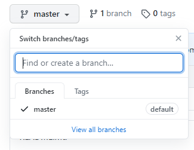

# Interactive Feature Branch Walkthrough

## Step 1 - Clone the repository locally
Navigate to a directory on your computer where you'd like to put this repository and execute the following command
```
git clone https://github.com/Elliott-Ruebush/aces_github_workshop.git
```

## Step 2 - Make a new feature branch to work on
You can list all of the currently existing branches using the following command
```
git branch -la
```
In order to create your very own branch, execute the following command
```
git checkout -b <super-special-branch-name>
```
This command will create a new branch that "branches" off of the branch you are currently in (master). Essentially, you're splitting the graph structure to create a new series of commits that will have a parent pointing back to the current commit in master. However, the master branch will continue to move forward with commits independently of the new branch you just made. This allows you to work on making changes to your specific feature branch while other people work on their own features and then subsequently merge them into master. You can then merge your feature branch back into master once you've successfully finished your feature. We'll demonstrate this process with the remainder of this tutorial.


## Step 3 - Make your changes and push them
First off, you'll need to make some changes to commit. In this walkthrough, I would prefer if everyone creates new directories/files for themselves because otherwise we might run into merge conflicts if multiple people edit the same file or create files with the same name. 

For example purposes, you can just quickly create a file with something like the following command
```
echo "hello world or something else fun" > <your-file-name>.txt
```

### Step 3.1 - Add and commit changes
Okay, now that you've spent hours and hours working on those major changes, you're ready to add and commit them (In reality, you should add and commit as often as reasonable to make sure that you have a granular history of exactly which changes happened with specific commits, which can make pinpointing where a bug was introduced much easier).

#### Step 3.1.1 - Adding
However, before adding, let's double check to see which changes we're actually going to add. We can use the following command to do so
```
git status
```
`git status` will give us a list of untracked changes and files as well as changes or files that have not been committed yet. If a file or change is untracked, that means that it's not yet checked into git, so if we want to add it to our repository we will need to `git add` it. 
There are two ways to use `git add`. We can either add specific files/changes with 
```
git add <file_name>
```
or we can add all of the changes/files with
```
git add -A
```

In this case, we can check `git status` to see what changes are available to add, and then add the new file you made using 
```
git add <your_file_name>
```

#### Step 3.1.2 - Committing
Now that we've added the files we want to commit, we're ready to actually create a commit to officially introduce those changes into our version history (we're basically adding a node to the graph representing our changes, where the node's parent will be whatever our last change was).

In order to commit our changes that we've `git add`ed, we will use the following command
```
git commit -m "helpful commit message here..."
```
to create a commit and an associated commit message that describes what changes were just committed. 

Congrats! You've just made a commit. You can check the commit history and see your commit using the command
```
git log
```

### Step 3.2 - Push changes to a remote branch
Okay, you've finished your changes and have made a local commit, but now we need to get those changes pushed up to the remote GitHub repository. 

The first time you push changes for a new branch, you'll need to tell git to establish a remote version of your feature branch. In order to do this we use the following command
```
git push --set-upstream <your-branch-name>
```
You can also type -u instead of --set-upstream. This command tells git to create a remote version of your branch with the same name and then associates that remote version with your local version so that you can push your commits to the remote version.

After this initial upstream setup, you'll simply need to run
```
git push
```
to push additional commits.

## Step 4 - Merge your branch into master
At this point, your feature branch should show up in the list of branches of the GitHub repository. You can click the branches dropdown in the left hand corner of the repository and search for your branch.



Now we want to merge your changes into the master branch so that they actually go into "production" and are a part of the official version of whatever product we're working on. 

GitHub calls a request to merge into master a "pull request" while Gitlab calls them "merge requests". The terms are essentially interchangeable and just depend on which platform you are using. (`git pull` is a command that just combines together `git fetch` + `git merge` to get remote changes and merge them).

In order to open a pull request on GitHub, you should first switch to your branch, 
